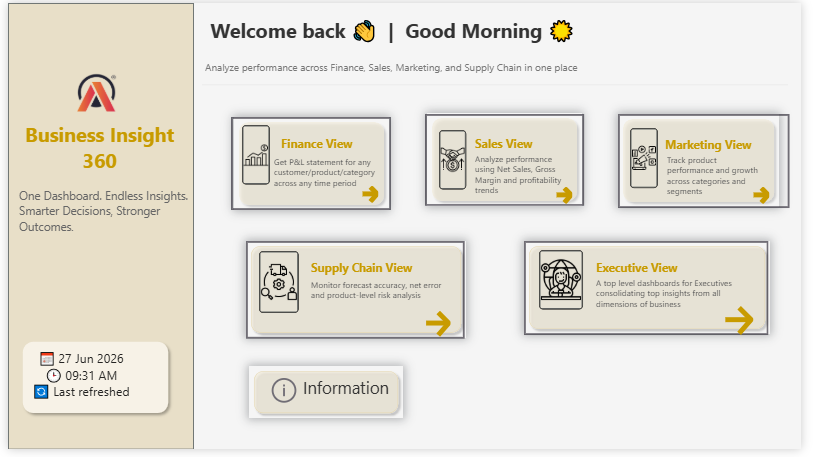
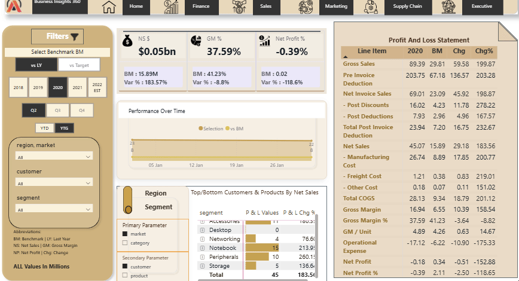
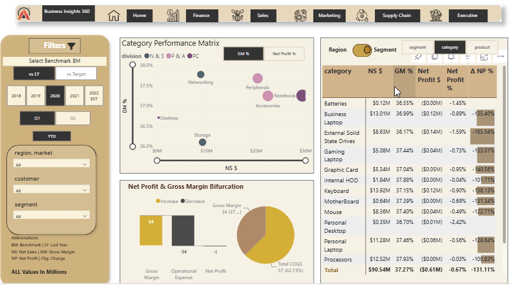

# 📊 Business Insights 360 | End-to-End Power BI Analytics Solution

Business Insights 360 is a comprehensive Business Intelligence solution developed in **Power BI** to help organizations monitor performance across **Finance, Sales, Marketing, Supply Chain, and Executive** functions from a single interactive dashboard.

The project transforms business data into actionable insights using interactive visualizations, KPI tracking, and advanced analytical techniques, enabling stakeholders to make informed business decisions with confidence.

---

# 📖 Project Overview

Organizations often generate massive amounts of business data, but turning that data into meaningful insights remains a challenge. Different departments rely on separate reports, making it difficult for decision-makers to understand the complete picture.

This project addresses that challenge by bringing together critical business metrics into a unified analytical platform. Through interactive dashboards, users can analyze financial performance, evaluate sales trends, monitor marketing effectiveness, improve forecasting accuracy, and gain executive-level insights—all within a single Power BI solution.

> **Note**
>
> The original datasets are not included in this repository due to data confidentiality. However, the complete PBIX file and interactive Power BI report are available through the links provided later in this README.

---

# 🎯 Business Challenge

The primary objective of this project was to design an interactive dashboard capable of answering critical business questions while providing stakeholders with real-time visibility into organizational performance.

The solution focuses on:

* Financial Performance Analysis
* Sales Performance Monitoring
* Product & Market Analysis
* Forecast Accuracy Evaluation
* Executive Decision Support

---

# 🛠 Tech Stack & Tools

| Category              | Technologies                       |
| --------------------- | ---------------------------------- |
| Business Intelligence | Power BI Desktop, Power BI Service |
| Data Transformation   | Power Query                        |
| Data Modeling         | Star Schema                        |
| Analytical Language   | DAX                                |
| Data Source           | Microsoft Excel                    |
| Version Control       | GitHub                             |

---

# 🗂 Data Sources & Architecture

The dashboard integrates business information collected from multiple operational domains including sales transactions, customer data, product information, market performance, financial metrics, and forecasting data.

A **Star Schema** data model was implemented to establish efficient relationships between fact and dimension tables, ensuring optimized performance and scalable analytical calculations.

---

# ⭐ Data Model Design

The analytical model follows a Star Schema architecture that improves query performance, reduces redundancy, and simplifies DAX calculations required for interactive reporting.

---

# 📊 Dashboard Walkthrough

## 🏠 Home View

The Home View serves as the central navigation hub of the dashboard, allowing users to seamlessly access every business module through an intuitive interface.

### Highlights

* Interactive navigation between dashboard pages
* User-friendly landing page
* Centralized access to all business functions

---

## 💰 Finance View

The Finance Dashboard provides a comprehensive overview of the organization's financial performance by tracking revenue, profitability, and key financial indicators across multiple fiscal periods.

### Key Insights

* Analyze Net Sales across fiscal years
* Monitor Gross Margin and Net Profit
* Compare financial performance across markets
* Evaluate overall profitability trends

---

## 📈 Sales View

The Sales Dashboard enables users to evaluate customer, product, and market performance while comparing current results against historical benchmarks and business targets.

### Key Insights

* Identify top-performing customers
* Analyze product contribution to revenue
* Compare market-wise sales performance
* Evaluate benchmark performance

---

## 📣 Marketing View

The Marketing Dashboard focuses on measuring category and product performance to identify revenue opportunities and understand profitability across different business segments.

### Key Insights

* Compare category performance
* Analyze product profitability
* Evaluate revenue contribution
* Identify high-growth opportunities

---

## 🚚 Supply Chain View

The Supply Chain Dashboard helps monitor forecasting accuracy and operational efficiency by providing insights into inventory risk, forecast errors, and customer-level performance.

### Key Insights

* Monitor Forecast Accuracy
* Analyze Net Error & Absolute Error
* Identify Inventory Risks
* Improve demand planning

---

## 👔 Executive View

The Executive Dashboard provides leadership teams with a consolidated view of organizational performance by combining key financial, operational, and strategic metrics into a single decision-support dashboard.

  

### Key Insights

* Executive KPI monitoring
* Cross-functional business analysis
* Revenue contribution analysis
* Organization-wide performance overview

---

# 💼 Business Questions Answered

The dashboard is designed to answer real-world business questions that help stakeholders make informed decisions across different business functions.

---

## 🏠 Home View

### Business Question
**How can users quickly navigate between different business functions within a single reporting solution?**

**Answer:**

The Home View acts as a centralized navigation page, allowing users to seamlessly switch between Finance, Sales, Marketing, Supply Chain, and Executive dashboards for a smooth analytical experience.

---

## 💰 Finance View

### Business Question
**Which market generated the highest Net Sales and Gross Margin during the selected fiscal period?**

**Answer:**

The Finance dashboard enables users to compare financial performance across different markets by analyzing Net Sales, Gross Margin, and Net Profit, helping identify the strongest revenue-generating markets.

---

## 📈 Sales View

### Business Question
**Which market contributes the highest Net Sales and Gross Margin in the LATAM region?**

**Answer:**

Using the Sales Performance Matrix, users can compare different LATAM markets and identify the market contributing the highest sales and profitability while analyzing customer and product performance.

---

## 📣 Marketing View

### Business Question
**Which product category generates the highest Gross Margin while maintaining better profitability?**

**Answer:**

The Marketing dashboard helps compare different product categories using Gross Margin, Net Profit, and Net Sales to identify the most profitable business segments.

---

## 🚚 Supply Chain View

### Business Question
**Which customers require immediate attention due to low Forecast Accuracy and high Inventory Risk?**

**Answer:**

The Supply Chain dashboard highlights customers with lower forecasting accuracy, higher net errors, and inventory risks, enabling better demand planning and operational decisions.

---

## 👔 Executive View

### Business Question
**Which customers contribute the highest revenue, and how are the organization's key KPIs performing overall?**

**Answer:**

The Executive dashboard provides leadership with a consolidated overview of organizational KPIs, highlighting top customers, top-performing products, revenue contribution, profitability, and forecast accuracy.

---

# 🎯 Business Impact

This project demonstrates how Business Intelligence can transform raw business data into meaningful insights by integrating multiple functional areas into a single analytical platform.

### Key Outcomes

- Improved visibility into organizational performance.
- Enabled data-driven decision-making through interactive dashboards.
- Simplified financial and sales performance analysis.
- Enhanced forecasting and supply chain monitoring.
- Delivered executive-level KPI reporting in one place.

---

# 🚀 Skills Demonstrated

### Power BI

- Interactive Dashboard Design
- Data Modeling (Star Schema)
- DAX Measures & Calculations
- Power Query (ETL)
- KPI Development
- Drill-through & Navigation
- Bookmark Navigation
- Report Optimization

### Business Analysis

- Financial Analysis
- Sales Performance Analysis
- Marketing Analytics
- Supply Chain Analytics
- Executive Reporting
- KPI Monitoring
- Forecast Analysis

---

# 🌐 Explore the Interactive Dashboard

👉 **Live Power BI Report**

**https://app.powerbi.com/links/XYo3IwCCtH?ctid=d8fc6b16-3ea1-44b5-853d-e03e9f1cdf7b&pbi_source=linkShare**

---

# 📥 Download the PBIX File

👉 **Google Drive**

**https://drive.google.com/file/d/177yfjR-RTGjFUjrGWNNsIIRp-kVlIFVI/view?usp=sharing**

---

# 👩‍💻 Connect With Me

**LinkedIn**

**https://www.linkedin.com/in/mlakshmisujatha/**

---

# 🙏 Acknowledgements

This project was developed as part of my continuous learning journey in Business Intelligence and Power BI. Special thanks to **Codebasics** for providing the inspiration and learning resources that helped me strengthen my understanding of real-world business analytics and dashboard development.

If you found this project helpful, feel free to ⭐ star this repository and connect with me on LinkedIn!
